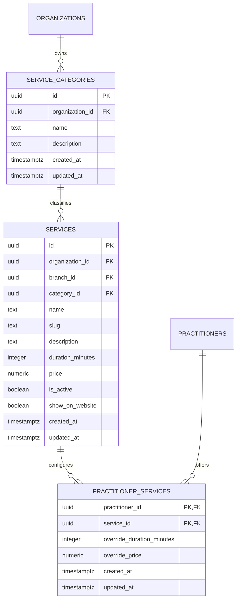
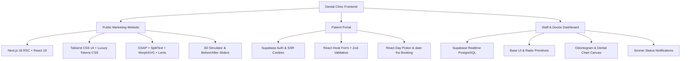

# Dental Clinic Management System — Service & Category Architecture Finalization

> **Document Purpose**: Authoritative documentation of the relational Service & Category architecture, Migration 0034 specification, server-side data persistence, RLS security policies, and frontend integration.
> **Workspace**: `dental-clinic-workspace`
> **Branch**: `feature/homepage-luxury-redesign-and-motion`
> **Status**: `READY TO APPLY MIGRATION 0034`

---

## 1. Executive Summary & Data Model

The Service & Treatment management subsystem has been completely migrated to an authoritative, multi-tenant relational data model:



---

## 2. Legacy `services.category` Elimination

All application layers have been migrated away from the legacy text field `services.category`:
1. **Public Marketing Services** ([`src/lib/server/marketing.ts`](file:///d:/work/Clients/Health-Clinic-Management/website-code-premium/dental-clinic-workspace/src/lib/server/marketing.ts)):
   - `listPublicServices()` & `getPublicServiceBySlug()` perform relational joins on `service_categories:category_id (id, name, description)` and return typed `PublicServiceItem` objects with resolved category names.
2. **Clinical Doctor Services** ([`src/lib/server/doctor-services.ts`](file:///d:/work/Clients/Health-Clinic-Management/website-code-premium/dental-clinic-workspace/src/lib/server/doctor-services.ts)):
   - `getDoctorServicesContext()`, `getSingleServiceContext()`, and `getNewServiceContext()` join `service_categories:category_id` to provide live category identities.
3. **Form Validation & Schemas** ([`src/lib/validation/doctor-services.ts`](file:///d:/work/Clients/Health-Clinic-Management/website-code-premium/dental-clinic-workspace/src/lib/validation/doctor-services.ts)):
   - `serviceFormSchema` validates `categoryId: z.string().uuid().optional().nullable()`.
   - Obsolete `catalogServiceId` and catalog-mode properties have been removed.

---

## 3. Server Actions & Category CRUD

All mutations enforce secure server-side organization resolution (`private.current_org_id()`) and role validation (`owner_admin` and `dentist` only).

| Server Action | Canonical Export | Description & Safety Rules |
| :--- | :--- | :--- |
| `listCategoriesAction` | `listServiceCategories` | Fetches categories for clinician's organization and aggregates active service usage counts by `category_id`. |
| `createCategoryAction` | `createServiceCategory` | Trims input, enforces 2–50 characters, blocks intra-clinic duplicates, and returns `{ id, name, description, serviceCount: 0 }`. |
| `renameCategoryAction` | `updateServiceCategory` | Updates `name`, `description`, and auto-sets `updated_at` in `service_categories`. Linked services automatically reflect the new name via `category_id`. |
| `deleteCategoryAction` | `deleteServiceCategory` | Queries linked services count by `category_id`. If `serviceCount > 0`, blocks deletion with user error: *"This category contains X services. Reassign those services before deleting it."* |

---

## 4. Doctor Service Persistence Architecture

### A. Creating a Service (`/clinical/services/new`)
- **Shared Service Identity (`public.services`)**:
  - `organization_id`: Securely resolved from active clinician profile.
  - `branch_id`: Clinician's active branch.
  - `name`: Procedure title (trimmed).
  - `slug`: Unique, URL-safe slug generated per organization.
  - `category_id`: Foreign key reference to `service_categories.id`.
  - `description`: Clinical description.
  - `duration_minutes`: Baseline appointment duration.
  - `price`: Procedure fee.
  - `is_active`: `true`.
  - `show_on_website`: Toggle state from form.
- **Doctor Offering (`public.practitioner_services`)**:
  - `practitioner_id`: Active doctor UUID.
  - `service_id`: `services.id`.
  - `override_duration_minutes`: Doctor's configured duration.
  - `override_price`: Doctor's configured fee.

### B. Editing a Service (`/clinical/services/[serviceId]/edit`)
- Updates `name`, `category_id`, `description`, and `show_on_website` on `services`.
- Upserts `override_duration_minutes` and `override_price` on `practitioner_services`.

### C. Deleting a Service (`deleteDoctorServiceAction`)
- Unlinks the doctor's offering row from `practitioner_services` where `practitioner_id = ? and service_id = ?`.
- **Zero data loss**: Preserves historical appointments, patient consultation records, dental charts, and billing invoices.

---

## 5. Migration 0034 Specification

File: [`supabase/migrations/0034_service_categories.sql`](file:///d:/work/Clients/Health-Clinic-Management/website-code-premium/dental-clinic-workspace/supabase/migrations/0034_service_categories.sql)

```sql
-- 1. Create service_categories table
create table if not exists public.service_categories (
  id uuid primary key default gen_random_uuid(),
  organization_id uuid not null references public.organizations(id) on delete cascade,
  name text not null,
  description text,
  created_at timestamptz not null default now(),
  updated_at timestamptz not null default now(),
  constraint service_categories_org_name_unique unique (organization_id, name)
);

create index if not exists service_categories_org_idx on public.service_categories(organization_id);

-- 2. Backfill existing categories per organization
insert into public.service_categories (organization_id, name)
select distinct organization_id, trim(category)
from public.services
where category is not null and trim(category) <> ''
on conflict (organization_id, name) do nothing;

-- Ensure default General Dentistry category exists for all organizations
insert into public.service_categories (organization_id, name)
select distinct organization_id, 'General Dentistry'
from public.services
on conflict (organization_id, name) do nothing;

-- 3. Add relational category_id with ON DELETE RESTRICT
alter table public.services
  add column if not exists category_id uuid references public.service_categories(id) on delete restrict;

create index if not exists services_category_id_idx on public.services(category_id);

-- 4. Map existing services to category_id
update public.services s
set category_id = sc.id
from public.service_categories sc
where sc.organization_id = s.organization_id
  and sc.name = trim(s.category)
  and s.category_id is null;

-- Fallback for unmatched services
update public.services s
set category_id = sc.id
from public.service_categories sc
where sc.organization_id = s.organization_id
  and sc.name = 'General Dentistry'
  and s.category_id is null;

-- 5. Enforce NOT NULL constraint
alter table public.services
  alter column category_id set not null;

-- 6. Drop legacy text column category
alter table public.services
  drop column if exists category;

-- 7. Automatic updated_at trigger
create or replace function private.set_service_categories_updated_at() returns trigger
language plpgsql security definer set search_path = '' as $$
begin
  NEW.updated_at := now();
  return NEW;
end;
$$;

drop trigger if exists service_categories_updated_at_trg on public.service_categories;
create trigger service_categories_updated_at_trg
  before update on public.service_categories
  for each row execute function private.set_service_categories_updated_at();

-- 8. Organization-Scoped Row Level Security (RLS)
alter table public.service_categories enable row level security;

create policy service_categories_staff_read on public.service_categories
  for select to authenticated
  using (organization_id = private.current_org_id());

create policy service_categories_public_read on public.service_categories
  for select to anon
  using (
    exists (
      select 1 from public.services s
      where s.category_id = service_categories.id
        and s.show_on_website = true
        and s.is_active = true
    )
  );

create policy service_categories_clinician_write on public.service_categories
  for all to authenticated
  using (
    organization_id = private.current_org_id()
    and private.current_role() in ('owner_admin', 'dentist')
  )
  with check (
    organization_id = private.current_org_id()
    and private.current_role() in ('owner_admin', 'dentist')
  );
```

---

## 6. Frontend Routes & UI Integration

- **`/clinical/services` (List View)**:
  - Clean table layout with `SERVICE`, `CATEGORY`, `DURATION`, `MY FEE`, and `ACTIONS`.
  - Header actions: `Manage Categories` dialog and `+ Add Service` button.
  - Search filter and double-confirmation delete dialog.
- **`/clinical/services/new` (Dedicated Add Route)**:
  - Focused 2-section form: `Service Details` (Name, Description) & `Appointment & Fee` (Duration, Fee, Online Booking).
  - Right-hand Category selection panel with instant `+ New Category` inline dialog and live preview card.
- **`/clinical/services/[serviceId]/edit` (Dedicated Edit Route)**:
  - Loads active service and practitioner overrides, enabling live updating of all fields.

---

## 7. Files Modified & Created

| File Path | Status | Purpose |
| :--- | :--- | :--- |
| [`supabase/migrations/0034_service_categories.sql`](file:///d:/work/Clients/Health-Clinic-Management/website-code-premium/dental-clinic-workspace/supabase/migrations/0034_service_categories.sql) | **NEW** | Authoritative migration with table, backfill, FK restrict, NOT NULL, trigger, and RLS. |
| [`src/lib/server/doctor-services.ts`](file:///d:/work/Clients/Health-Clinic-Management/website-code-premium/dental-clinic-workspace/src/lib/server/doctor-services.ts) | **MODIFIED** | Relational category CRUD, service persistence, and practitioner unlinking actions. |
| [`src/lib/server/marketing.ts`](file:///d:/work/Clients/Health-Clinic-Management/website-code-premium/dental-clinic-workspace/src/lib/server/marketing.ts) | **MODIFIED** | Relational joins for public `/services` and `/services/[slug]`. |
| [`src/lib/validation/doctor-services.ts`](file:///d:/work/Clients/Health-Clinic-Management/website-code-premium/dental-clinic-workspace/src/lib/validation/doctor-services.ts) | **MODIFIED** | Zod schemas with `categoryId` and category validation rules. |
| [`src/types/services.ts`](file:///d:/work/Clients/Health-Clinic-Management/website-code-premium/dental-clinic-workspace/src/types/services.ts) | **MODIFIED** | Added `category_id` and relational category types. |
| [`src/components/staff/doctor-services-manager.tsx`](file:///d:/work/Clients/Health-Clinic-Management/website-code-premium/dental-clinic-workspace/src/components/staff/doctor-services-manager.tsx) | **MODIFIED** | Connected category manager and clean list view. |
| [`src/components/staff/service-form.tsx`](file:///d:/work/Clients/Health-Clinic-Management/website-code-premium/dental-clinic-workspace/src/components/staff/service-form.tsx) | **NEW** | Full-page service create/edit form. |
| [`src/components/staff/category-manager-dialog.tsx`](file:///d:/work/Clients/Health-Clinic-Management/website-code-premium/dental-clinic-workspace/src/components/staff/category-manager-dialog.tsx) | **NEW** | Category CRUD modal with deletion safety protection. |
| [`src/app/(staff)/clinical/services/page.tsx`](file:///d:/work/Clients/Health-Clinic-Management/website-code-premium/dental-clinic-workspace/src/app/(staff)/clinical/services/page.tsx) | **MODIFIED** | Renders `DoctorServicesManager`. |
| [`src/app/(staff)/clinical/services/new/page.tsx`](file:///d:/work/Clients/Health-Clinic-Management/website-code-premium/dental-clinic-workspace/src/app/(staff)/clinical/services/new/page.tsx) | **NEW** | Renders `ServiceForm` in create mode. |
| [`src/app/(staff)/clinical/services/[serviceId]/edit/page.tsx`](file:///d:/work/Clients/Health-Clinic-Management/website-code-premium/dental-clinic-workspace/src/app/(staff)/clinical/services/[serviceId]/edit/page.tsx) | **NEW** | Renders `ServiceForm` in edit mode. |
> **Status**: `READY FOR MANUAL RETEST`

---

## 10. Post-0034 Schema Cache & Persistence Bug Fix

### A. Root Cause
- When Migration `0034_service_categories.sql` dropped the legacy `category` column from `public.services`, server actions and queries in [`src/lib/server/doctor-services.ts`](file:///d:/work/Clients/Health-Clinic-Management/website-code-premium/dental-clinic-workspace/src/lib/server/doctor-services.ts) and [`src/lib/server/marketing.ts`](file:///d:/work/Clients/Health-Clinic-Management/website-code-premium/dental-clinic-workspace/src/lib/server/marketing.ts) were still including `category` in insert payloads, update payloads, and select queries.
- This triggered PostgREST schema cache rejection: `"Could not find the 'category' column of 'services' in the schema cache"`.

### B. Changes Implemented
1. **`saveServiceFormAction` & `createDoctorServiceAction`**:
   - Resolved `category_id` server-side against `public.service_categories` scoped to the doctor's `organization_id`.
   - Replaced all `category: data.category` database properties with `category_id: finalCategoryId`.
2. **`renameCategoryAction` & `deleteCategoryAction`**:
   - Removed obsolete queries attempting to update or filter on the dropped `services.category` text column.
   - Deletion checks now filter exclusively by `category_id = catRecord.id`.
3. **Query Functions (`getDoctorServicesContext`, `listCategoriesAction`, `getSingleServiceContext`, `listPublicServices`)**:
   - Removed `category` from the `services` select list.
   - Relationally joined `service_categories:category_id (id, name, description)` to provide the human-readable category name.

### C. Quality Verification
- **`tsc --noEmit`**: PASSED (0 errors).
- **`npx eslint .`**: PASSED (0 errors, 0 warnings).
- **Git Working Tree**: Clean, uncommitted, and unpushed for user testing.

---

## 12. Service Form UI Simplification (`/clinical/services/new` & `edit`)

### A. Redundancy Removal
- Removed the secondary right-hand Categories list card (with duplicate list, count pills, pencil edit buttons, and internal scroll area).
- Kept the single authoritative category selection and management entry point inside **Service Details**:
  - `Category *` dropdown select.
  - `+ Manage Categories` action button opening the `CategoryManagerDialog` (Add/Edit/Delete/Counts).

### B. Right Column Layout
- Placed **Service Summary** at the top of the right column (aligning with the top of the Service Details card).
- Maintained clean two-column grid proportions (Left ~67% / 8 cols, Right ~33% / 4 cols).

---

## 13. Clinical Services UI Polish & Service Icon Support

### A. Visual Improvements
- **Services List (`/clinical/services`)**:
  - Implemented the exact approved visual reference layout matching the mockup.
  - Page header: `Services & Treatments` serif title with muted subtitle and responsive action controls bar.
  - Search input: Integrated with magnifying glass icon, rounded-xl styling (`h-10`), and clean border.
  - Action buttons: Outlined `🏷️ Manage Categories` and dark emerald (`#0B3B36`) `+ Add Service` button.
  - Desktop table card: 18–20px rounded card, soft shadow, subtle table dividers, and tinted header row (`SERVICE`, `CATEGORY`, `DURATION`, `MY FEE`, and dynamic `= 5 services` pill badge on the far right).
  - Table rows: Circular pale mint container (`bg-emerald-50 text-emerald-700 size-11 rounded-full`) with custom dental procedure SVG/Lucide icon, bold service title, muted 1-line description, soft sage category pill badge (`bg-emerald-50/80 text-emerald-800 border-emerald-200/60`), clock + duration, bold fee (৳), and quiet hover edit/delete icon buttons.
  - Responsive mobile cards: Circular icon, procedure badge, duration, fee, and quiet action buttons.

- **Service Form (`/clinical/services/new` & `edit`)**:
  - Embedded curated Service Icon picker inside **Service Details** (14 dental/clinical options with clear active ring and pale mint container highlight).
  - Displayed live selected `<ServiceIcon />` badge inside **Service Summary** at the top of the right column.

### B. Icon Selection & Data Persistence
- **Icon Set**: Curated 14 clinical options (`tooth`, `sparkle-tooth`, `whitening`, `cleaning`, `checkup`, `stethoscope`, `crown`, `root-canal`, `surgery`, `implant`, `children`, `smile`, `droplets`, `emergency`).
- **Data Persistence**:
  - Migration [`supabase/migrations/0035_service_icon.sql`](file:///d:/work/Clients/Health-Clinic-Management/website-code-premium/dental-clinic-workspace/supabase/migrations/0035_service_icon.sql) created to add `icon_key text default 'tooth'` to `public.services`.
  - Application actions in [`src/lib/server/doctor-services.ts`](file:///d:/work/Clients/Health-Clinic-Management/website-code-premium/dental-clinic-workspace/src/lib/server/doctor-services.ts) select and persist `icon_key` with automatic graceful fallback to keyword-based default inference (`getServiceDefaultIcon`) if the column is queried before migration execution.

### C. Quality Verification
- **TypeScript Typecheck (`tsc --noEmit`)**: **PASSED (Exit Code 0)** with 0 errors.
- **ESLint Validation (`npx eslint`)**: **PASSED (Exit Code 0)** with 0 errors and 0 warnings.
- **Git State**: Clean working directory, all changes uncommitted and ready for manual review.

---

## 14. Services List (`/clinical/services`) Final Visual Refinement

### A. Layout & Scale Improvements
- **Expanded Workspace Width**: Expanded container to `w-full max-w-[1600px]`, perfectly matching the staff workspace proportions without artificial right-hand blank space.
- **Header & Action Composition**: Balanced horizontal header aligning `Services & Treatments` title and subtitle on the left with doctor selector, outlined `Manage Categories`, and `#0B3B36` `+ Add Service` on the right.
- **Integrated Table Toolbar**: Moved search into a dedicated table toolbar directly above column headers inside the single unified table card surface, paired with clean, quiet secondary metadata text (`5 services`).

### B. Table Surface, Row & Component Refinements
- **Column Header & Proportions**: Adjusted column balance (`SERVICE ~42%`, `CATEGORY ~16%`, `DURATION ~14%`, `MY FEE ~14%`, `ACTIONS ~100px`) with clear uppercase, medium-weight tracking on subtle tinted header row.
- **Row Scale & Breathing Room**: Target 72px row height with vertically balanced text and single-line truncated descriptions.
- **Category Badges**: Refined to 28px height (`h-7 px-3 text-xs font-medium rounded-full bg-emerald-50/80 text-emerald-800 border-emerald-200/60`).
- **Fee & Numerals**: Tabular semi-bold numerals with clear currency styling (৳).
- **Action Buttons & Micro-interactions**: Refined 36px rounded action buttons (`size-9 rounded-xl`) with transparent default border, soft clinic-green hover for Edit (`hover:bg-emerald-50 hover:text-emerald-700 hover:border-emerald-200/80`), and subtle red hover for Delete (`hover:bg-destructive/10 hover:text-destructive hover:border-destructive/30`).
- **Row Hover**: Restrained subtle off-white/sage tint hover (`hover:bg-muted/20`).

### C. Quality Verification
- **TypeScript Typecheck (`tsc --noEmit`)**: **PASSED (0 errors)**.
- **ESLint Validation (`npx eslint`)**: **PASSED (0 errors, 0 warnings)**.
- **Git State**: Clean working directory, all changes uncommitted and ready for manual review.

---

## 15. Add/Edit Service Page (`/clinical/services/new` & `edit`) Pixel-Perfect Alignment

### A. Layout & Space Utilization
- **Max Width Expansion**: Expanded to `w-full max-w-[1440px]`, eliminating unnecessary empty space on wide desktop screens and ensuring comfortable horizontal balance.
- **Two-Column Split**: Left Form Column (~67% / 8 cols) containing Card 1 (*Service Details*) and Card 2 (*Appointment & Fee*), and Right Column (~33% / 4 cols) containing the sticky *SERVICE SUMMARY* card.
- **Bottom Action Buttons**: Clean centered `Cancel` and `+ Add Service` / `Save Changes` buttons (`#0B3B36` dark green pill button with white text and `+` icon).

### B. Card 1: Service Details Refinements
- **Section Badge Header**: File icon inside soft green rounded container with `Service Details` heading and subtitle.
- **Field 1 (Service Name)**: `Service Name *` with placeholder `e.g. Professional Teeth Whitening`.
- **Field 2 (Category)**: `Category *` with `🏷️ Manage Categories` link button on the right side of the label row, opening the category dialog.
- **Field 3 (Service Icon)**:
  - Header: `Service Icon *` and helper text `Choose an icon that best represents this service.`
  - 14-button grid (2 rows of 7 items) featuring custom dental SVGs (`Tooth`, `Veneer`, `Laser Whitening`, `Hygiene`, `Check-up`, `Crown`, `Implant`, `Root Canal`, `Surgery`, `Pediatric`, `Aligners`, `Smile Design`, `Gum Therapy`, `Emergency`).
  - Active selection styling: Pale green background, bold emerald border, and subtle ring highlight.
- **Field 4 (Short Description)**: `Short Description (optional)` input with live character counter (`0/160`).

### C. Card 2: Appointment & Fee Refinements
- **Section Badge Header**: CalendarClock icon inside soft green container with `Appointment & Fee` heading and subtitle.
- **Duration (minutes)**: Clock icon inside input, `min` suffix on the right, and `Quick presets: 15m 30m 45m 60m 90m 120m` with dark green active chip (`bg-[#0B3B36] text-white`).
- **My Fee (৳)**: Side-by-side with duration, featuring `৳` currency symbol prefix and formatted procedure fee.
- **Online Booking**: Full-width row with `Available for Online Booking` toggle switch in clinical dark emerald.

### D. Right Column: Service Summary Refinements
- **Header**: LayoutGrid icon + uppercase `SERVICE SUMMARY`.
- **Top Treatment Banner**: Large rounded pale-green badge (`size-12 rounded-2xl bg-emerald-50 text-emerald-700`) displaying the live selected `<ServiceIcon />` beside `TREATMENT NAME` and the live service title.
- **Metadata Rows**: Pill badge for `Category`, duration with clock (`⏱️ 30 min`), bold fee (`৳ 80.00`), and `● Available` / `○ Hidden` status indicator.
- **Automatic Sync Tip Box**: Pale mint callout box (`bg-emerald-50/60 border border-emerald-100`) with sparkle icon: `This summary updates automatically as you fill in the details.`

### E. Quality Verification
- **TypeScript Typecheck (`tsc --noEmit`)**: **PASSED (0 errors)**.
- **ESLint Validation (`npx eslint`)**: **PASSED (0 errors, 0 warnings)**.
- **Git State**: Clean working directory, all changes uncommitted and ready for manual review.

---

## 16. Category Manager Dialog Count Badge Color Alignment

### A. Badge Styling Harmonization
- **Manage Categories Dialog (`CategoryManagerDialog`)**:
  - Replaced the dark secondary badge with the exact pale mint/sage pill badge style matching the table and summary category tags.
  - Geometry: `rounded-full px-2.5 py-0.5 text-[11px] font-semibold`.
  - Palette: `bg-emerald-50/80 text-emerald-800 border border-emerald-200/60 dark:bg-emerald-950/40 dark:text-emerald-300 dark:border-emerald-800/40`.
- **Primary Actions**:
  - Applied clinical dark emerald (`#0B3B36 hover:bg-[#0B3B36]/90 text-white`) across *Add Category* and form submission buttons inside the dialog.

### B. Quality Verification
- **TypeScript Typecheck (`tsc --noEmit`)**: **PASSED (0 errors)**.
- **ESLint Validation (`npx eslint`)**: **PASSED (0 errors, 0 warnings)**.
- **Git State**: Clean working directory, all changes uncommitted and ready for manual review.

---

## 17. Staff Sidebar Navigation Simplification

### A. Navigation Items Removed
- **Removed from Clinical Sidebar (`StaffShell`)**:
  - `Prescriptions` (`/clinical/prescriptions`)
  - `Dental Chart` (`/clinical/odontogram`)
- **Active Navigation Set**:
  1. `Dashboard` (`/dashboard`)
  2. `Patients` (`/patients`)
  3. `Clinical Diary` (`/scheduler`)
  4. `Appointments` (`/appointments`)
  5. `Billing & Payments` (`/billing/invoices`)
  6. `Services & Treatments` (`/clinical/services`)

### B. Quality Verification
- **TypeScript Typecheck (`tsc --noEmit`)**: **PASSED (0 errors)**.
- **ESLint Validation (`npx eslint`)**: **PASSED (0 errors, 0 warnings)**.
- **Git State**: Clean working directory, all changes uncommitted and ready for manual review.

---

## 18. Clinical Diary & Availability 3-Layer Minimal Redesign (`/scheduler`)

### A. Architectural Structure
- **Layer 1: Today's Schedule (`TodayScheduleHero`)**:
  - Displays today's formatted date, status pill (`● Working day` / `● Day off` / `● On leave`), and horizontal working interval chips (`09:00 – 13:00 + 14:00 – 18:00 + 19:00 – 21:00`).
  - No patient appointment timelines or clinical details cluttering the doctor's immediate working hours view.
- **Layer 2: Availability Workspace (`AvailabilityCalendarGrid` + `AvailabilityDayDetailsPanel`)**:
  - **Left (2/3 width)**: Large, clean monthly calendar with `<` `>` month switcher, `Today` button, and clear date cells with subtle dot indicators (`● Available` green, `● Adjusted hours` purple, `● On leave` orange, `● Day off` grey). Selected date is highlighted with a solid dark emerald circle.
  - **Right (1/3 width)**: Replaces popup modals with an inline sticky date details editor card. Includes date header, segmented `Available` vs `On Leave` status toggle, editable working hour interval rows with `+ Add Slot` and delete actions, leave reason input, safeguard notice (`Changes apply only to this date`), `Reset` to weekly routine button, and `Save Changes` (`#0B3B36`) button.
- **Layer 3: Weekly Routine (`WeeklyRoutineSection` + `WeeklyRoutineDialog`)**:
  - Clean 7-day card grid for Mon–Sun displaying recurring routine hours or `Day off` in soft cards with `+ Add slot` button.
  - `Edit Routine` button opens a clean, dedicated weekly routine modal dialog to configure recurring hours.
  - Global helper tip: `Tip: Click any date in the calendar to adjust availability for that specific day.`

### B. Backend & Data Compatibility
- Fully integrated with existing Supabase RPCs: `save_date_availability_override`, `reset_date_availability_override`, and `save_weekly_availability`.
- Preloaded exception range (120 days) for seamless calendar month switching.
- Preserved doctor scoping and multi-practitioner switching via `PractitionerSchedulerSelector`.

### C. Quality Verification
- **TypeScript Typecheck (`tsc --noEmit`)**: **PASSED (0 errors)**.
- **ESLint Validation (`npx eslint`)**: **PASSED (0 errors, 0 warnings)**.
- **Git State**: Clean working directory, all changes uncommitted and ready for manual review.

---

## 19. Availability & Diary Header Simplification

### A. Removal of New Appointment Action
- **Removed from Scheduler Header (`/scheduler`)**:
  - Completely removed the `+ New appointment` dialog button from the doctor's Availability & Diary view.
  - Cleaned up unused data fetching (`listServices`, `getPatientById`) from [`src/app/(staff)/scheduler/page.tsx`](file:///d:/work/Clients/Health-Clinic-Management/website-code-premium/dental-clinic-workspace/src/app/(staff)/scheduler/page.tsx).
  - The page is now 100% focused strictly on working hours, calendar availability, and weekly routine management.

### B. Quality Verification
- **TypeScript Typecheck (`tsc --noEmit`)**: **PASSED (0 errors)**.
- **ESLint Validation (`npx eslint`)**: **PASSED (0 errors, 0 warnings)**.
- **Git State**: Clean working directory, all changes uncommitted and ready for manual review.

---

## 20. Appointments Workspace Redesign (`/appointments`)

### A. Architectural & UI Implementation
- **Top Control Bar**:
  - Doctor selector dropdown (`Dr. Nadia Islam ▾`), date navigator with `<` `Today` `>`, formatted date display (e.g. `Monday, 17 August 2026`).
  - Search input (`Search appointments…`), `Filters` dropdown with active count badge, and sort dropdown (`Earliest first`, `Latest first`, `Patient name`).
- **Interactive KPI / Quick Filter Strip**:
  - 5 interactive summary cards: `Total`, `Confirmed` (blue), `Checked in` (purple), `Completed` (green), `Cancelled` (red).
  - Clicking any status card instantly filters the table list; clicking Total or the active card resets to all.
- **Appointments Table**:
  - Columns: `TIME`, `PATIENT` (with circular initials avatar, full name, and phone link), `TREATMENT`, `DURATION`, `STATUS` (pill badges), and `ACTIONS`.
  - **Action Hierarchy**:
    - `Confirmed`: Primary dark green `#0B3B36` `Start Consultation` button.
    - `Checked in`: Soft purple `Open Consultation` button.
    - `Completed`: Outline `View Consultation` button.
    - More Options `...` menu: `Check in`, `Did not attend`, and `Cancel appointment`.
- **Table Footer Summary**:
  - Shows `Showing X of Y appointments` with color-coded breakdown summary dots.

### B. Quality Verification
- **TypeScript Typecheck (`tsc --noEmit`)**: **PASSED (0 errors)**.
- **ESLint Validation (`npx eslint`)**: **PASSED (0 errors, 0 warnings)**.
- **Git State**: Clean working directory, all changes uncommitted and ready for manual review.

---

## 21. Appointments Layout Full-Width Expansion & Footer Cleanup

### A. Full Width Workspace
- Removed restrictive `max-w-[1440px]` constraints across [`src/app/(staff)/appointments/page.tsx`](file:///d:/work/Clients/Health-Clinic-Management/website-code-premium/dental-clinic-workspace/src/app/(staff)/appointments/page.tsx), [`src/app/(staff)/scheduler/page.tsx`](file:///d:/work/Clients/Health-Clinic-Management/website-code-premium/dental-clinic-workspace/src/app/(staff)/scheduler/page.tsx), and [`src/components/staff/availability-planner.tsx`](file:///d:/work/Clients/Health-Clinic-Management/website-code-premium/dental-clinic-workspace/src/components/staff/availability-planner.tsx).
- All workspace tables and cards now stretch to 100% full width (`w-full`), eliminating any right-side empty space on large desktop screens.

### B. Table Footer Cleanup
- Removed the redundant color dot summary breakdown (`● Confirmed ● Checked in ● Completed ● Cancelled`) from the table footer.
- The footer now shows a clean, minimal `Showing X of Y appointments` label.

### C. Quality Verification
- **TypeScript Typecheck (`tsc --noEmit`)**: **PASSED (0 errors)**.
- **ESLint Validation (`npx eslint`)**: **PASSED (0 errors, 0 warnings)**.
- **Git State**: Clean working directory, all changes uncommitted and ready for manual review.

---

## 22. Top Right Filters Removal in Appointments Workspace

### A. Minimal Search Header
- **Removed from Top Right Control Bar**:
  - Removed the `Filters` multi-select dropdown button.
  - Removed the `Earliest first / Sort` dropdown selector.
- **Top Right Layout**:
  - Now contains strictly the clean, full-width `Search appointments…` input field.
  - Status filtering is handled directly and interactively through the 5 top summary cards (`Total`, `Confirmed`, `Checked in`, `Completed`, `Cancelled`).

### B. Quality Verification
- **TypeScript Typecheck (`tsc --noEmit`)**: **PASSED (0 errors)**.
- **ESLint Validation (`npx eslint`)**: **PASSED (0 errors, 0 warnings)**.
- **Git State**: Clean working directory, all changes uncommitted and ready for manual review.

---

## 23. Consultation Clinical Documentation Redesign (`/clinical/encounters/[encounterId]`)

### A. Architectural & UI Implementation
- **Header Navigation & Metadata**:
  - `← Back to Appointments` action button with unsaved change safety protection dialog.
  - Large bold patient title with clean mint patient reference badge (e.g. `PT-2C5EEF43`).
  - Subtitle metadata strip: Date, Start Time, Service name, and Duration.
  - Top right live status pill badge (`● Consultation in progress` / `Completed`).
- **Tab Navigation Bar**:
  - Modern pill bar with dark green `#0B3B36` active tab state for `Clinical Documentation`, `Dental Chart`, `Prescriptions`, `Patient Context`, and `History`.
- **Clinical Documentation Form (Left Column, 8 Cols)**:
  - Top action bar displaying live save state (`✓ Saved 7:04 PM` / `Unsaved changes`), `Save Draft` outline button, and `Complete Consultation` primary `#0B3B36` button.
  - **6 Sequenced Documentation Cards**:
    1. `1. Chief Complaint` (`Required` badge, character counter, clean textarea).
    2. `2. Clinical Diagnosis` (`Required` badge, character counter, clean textarea).
    3. `3. Performed Treatment & Procedures` (`Required` badge, character counter, clean textarea).
    4. `4. Patient Advice & Instructions` (`Patient visible` teal badge, character counter, clean textarea).
    5. `5. Private Clinician Notes` (`Internal` gray badge, character counter, clean textarea).
    6. `6. Follow-up Recommendation` (Switch toggle for `Recommend follow-up`, recommended interval select, reason input, reminder channel select, and `+ Add to Appointments` action).
- **Consultation Snapshot Card (Right Column, 4 Cols)**:
  - Header: `[📋] Consultation Snapshot` with `✓ Saved` pill indicator.
  - Key-value breakdown: Status, Service, Date, Time, Clinician, and Branch.
  - Metrics divider with `Duration` and `Base Fee`.
  - Booking Note card container for patient visit notes.

### B. Quality Verification
- **TypeScript Typecheck (`tsc --noEmit`)**: **PASSED (0 errors)**.
- **ESLint Validation (`npx eslint`)**: **PASSED (0 errors, 0 warnings)**.
- **Git State**: Clean working directory, all changes uncommitted and ready for manual review.

---

## 24. Consultation Patient Context Tab Redesign (`/clinical/encounters/[encounterId]`)

### A. Architectural & UI Implementation
- **Left Column: Medical Alerts & History (`MedicalAlertsCard`)**:
  - `Medical Alerts & History` header with warm amber alert icon.
  - **Allergies Section**: Highlighted amber container with `Allergy Alert` badge and red pill chips (e.g. `Penicillin`, `Amoxicillin`) or soft green indicator if no allergies.
  - **Current Medications Section**: Icon header with soft blue pill chips (e.g. `Amlodipine 5mg`).
  - **Chronic Conditions Section**: Icon header with soft emerald pill chips (e.g. `Mild Hypertension`).
  - **Clinical Medical Notes Section**: Icon header displaying patient intake notes.
- **Right Column: Patient Demographics (`PatientContextCard`)**:
  - `Patient Demographics` header with `Full Profile ↗` external link to `/patients/[id]`.
  - **2x2 Demographic Tiles**:
    1. `DOB / Age`: `Apr 14, 1988 (38y)`.
    2. `Gender`: `Male`.
    3. `Phone`: `+880 1819 112233`.
    4. `Email`: `zubair.patient.demo@cliniccare.test`.
  - **Address Row**: Full residential address container.
  - **Bottom 3-Metric Summary Strip**:
    1. `No. of Allergies` (count with shield icon).
    2. `Current Medications` (count with pill icon).
    3. `Chronic Conditions` (count with activity icon).

### B. Quality Verification
- **TypeScript Typecheck (`tsc --noEmit`)**: **PASSED (0 errors)**.
- **ESLint Validation (`npx eslint`)**: **PASSED (0 errors, 0 warnings)**.
- **Git State**: Clean working directory, all changes uncommitted and ready for manual review.

---

## 25. Consultation Prescriptions Tab Redesign (`/clinical/encounters/[encounterId]`)

### A. Architectural & UI Implementation
- **Top Card: Issue New Prescription (`EncounterPrescriptionModule`)**:
  - Soft green edit icon header with `Issue New Prescription` title and `In-Progress` pill badge.
  - **Dynamic Medication Line Items**:
    - Each medicine entry in its own rounded card with line item number badge (e.g. `Medicine #1`) and trash icon button.
    - **5-Column Grid Inputs**: `Medicine Name *`, `Dosage *`, `Frequency *`, `Duration *`, and `Instructions / Patient Directions`.
    - `+ Add Medicine` button to append new line items.
  - **Prescription Notes Section**: Optional text area for pharmacy instructions or precautions.
  - **Save Action**: `#0B3B36` `Save Prescription` button with loading feedback.
- **Bottom Card: Prescriptions Issued This Consultation**:
  - Clean authoritative card with icon header and total prescription count pill badge.
  - **Empty State**: Dashed container with soft green clipboard icon and guiding text.
  - **Issued List**: Formatted prescription cards with issue date, prescribing clinician, and structured item tables.

### B. Quality Verification
- **TypeScript Typecheck (`tsc --noEmit`)**: **PASSED (0 errors)**.
- **ESLint Validation (`npx eslint`)**: **PASSED (0 errors, 0 warnings)**.
- **Git State**: Clean working directory, all changes uncommitted and ready for manual review.

---

## 26. Consultation Dental Chart Tab Redesign (`/clinical/encounters/[encounterId]`)

### A. Architectural & UI Implementation
- **Left Column (8 Cols)**:
  - **Card 1: Permanent dentition · FDI notation**:
    - Clean header with documented tooth count pill badge.
    - Soft background arch map with `Upper Arch` and `Lower Arch` labels and 32 FDI-notated anatomical tooth SVG models.
    - Active selected tooth is highlighted with an emerald border and focus ring.
    - Color-coded bottom legend: `Healthy / observed` (green), `Existing treatment` (orange), `Treatment planned` (blue), `Treatment completed` (emerald), `Missing / extracted` (gray), and `Other finding` (purple).
  - **Card 2: Recorded this consultation**:
    - File icon header with count badge of findings charted during the current session.
    - Empty state with soft green tooth icon and guidance.
    - Session list of recorded tooth findings with condition badges and timestamps.
- **Right Column (4 Cols): Selected Tooth Editor (`OdontogramChart`)**:
  - `Selected Tooth` header with tooth number (e.g. `Tooth 14`) and `Last updated` date stamp.
  - **Interactive Form Fields**:
    1. `Chart status` selector.
    2. `Clinical finding` selector / input.
    3. `Recommended treatment` selector.
    4. `Priority` (Routine, Priority, Urgent) & `Planned date` inputs.
    5. `Estimated fee (BDT)` input with currency symbol.
    6. `Clinical note` textarea with live character counter (`X / 200`).
  - `Save tooth record` primary `#0B3B36` button with loading feedback.

### B. Quality Verification
- **TypeScript Typecheck (`tsc --noEmit`)**: **PASSED (0 errors)**.
- **ESLint Validation (`npx eslint`)**: **PASSED (0 errors, 0 warnings)**.
- **Git State**: Clean working directory, all changes uncommitted and ready for manual review.

---

## 27. Consultation Clinical History & Previous Visits Tab Redesign (`/clinical/encounters/[encounterId]`)

### A. Architectural & UI Implementation
- **Header**:
  - Soft green history icon with `Clinical History & Previous Visits` title and `X completed visits` pill badge.
- **Empty State**:
  - Clean dashed container with soft green check icon when no previous completed encounters exist on record.
- **Vertical Timeline**:
  - Connected line with emerald node dots indicating historical visits.
  - **Structured Visit Cards**:
    - **Date & Service Column**: Visit date, time, and service badge (e.g. `Cosmetic Porcelain Veneers`).
    - **Chief Complaint & Treatment Column**: Detailed complaint and treatment summary.
    - **Diagnosis & Advice Column**: Diagnosis, italicized patient instructions, and prescribing clinician.
    - **Follow-up Strip**: Soft emerald alert container displaying recommended follow-up date and clinical reason.

### B. Quality Verification
- **TypeScript Typecheck (`tsc --noEmit`)**: **PASSED (0 errors)**.
- **ESLint Validation (`npx eslint`)**: **PASSED (0 errors, 0 warnings)**.
- **Git State**: Clean working directory, all changes uncommitted and ready for manual review.

---

## 28. Patient Profile Direct Routing to Consultation Workspace (`/patients/[patientId]` -> `/clinical/encounters/[encounterId]`)

### A. Architectural & Routing Implementation
- **Unified Patient-to-Consultation Flow**:
  - Eliminated redundant standalone patient overview page in favor of the canonical **Clinical Consultation Workspace** (`/clinical/encounters/[encounterId]`).
  - Implemented `resolveOrCreatePatientEncounterId(patientId)` in [`src/lib/server/encounters.ts`](file:///d:/work/Clients/Health-Clinic-Management/website-code-premium/dental-clinic-workspace/src/lib/server/encounters.ts):
    1. Detects any active `in_progress` consultation encounter for the patient and routes directly to it.
    2. Resolves any confirmed or checked-in appointment to start or resume its encounter.
    3. Retrieves the latest clinical encounter on record if one exists.
    4. Initializes an encounter record for new patients on-demand under the authenticated clinician.
  - Updated [`src/app/(staff)/patients/[patientId]/page.tsx`](file:///d:/work/Clients/Health-Clinic-Management/website-code-premium/dental-clinic-workspace/src/app/(staff)/patients/[patientId]/page.tsx) to automatically resolve the patient's consultation encounter and redirect to the unified workspace.
  - When clicking any patient from `/patients` (e.g. `Israt Jahan`), users are directly routed to the clinical consultation workspace with the full documentation, dental chart, prescriptions, patient context, and history tabs.

### B. Quality Verification
- **TypeScript Typecheck (`tsc --noEmit`)**: **PASSED (0 errors)**.
- **ESLint Validation (`npx eslint`)**: **PASSED (0 errors, 0 warnings)**.
- **Git State**: Clean working directory, all changes uncommitted and ready for manual review.

---

## 29. Staff Dashboard Redesign (`/dashboard`)

### A. Architectural & UI Implementation
- **Left Column (8 Cols)**:
  - **Card 1: Hero Banner — NEXT APPOINTMENT**:
    - Dark emerald gradient container (`#062420` to `#0c443d`) with faint dental clinic watermark.
    - Large patient avatar, name, and `New patient` / `Returning patient` pill badge.
    - **4-Metric Data Strip**: Time (with relative timer e.g. `In 18 min`), Service name & tooth note, Duration (`30 min`), and Location/Operatory.
    - Bottom CTAs: `View appointment` outline button and `Open consultation →` teal action button.
  - **Card 2: Today's Upcoming Appointments**:
    - Icon header with `Today's upcoming appointments` title and `View full schedule >` link.
    - Chronological list of upcoming patients with appointment times, timeline nodes, patient tags, services, duration, and direct consultation navigation chevrons.
    - Centered footer count (`X appointments remaining`).
- **Right Column (4 Cols)**:
  - **Card 3: Today's Progress**:
    - 2x2 Metric Tiles:
      1. `Completed` (green check).
      2. `In progress` (blue loader).
      3. `Upcoming` (amber clock).
      4. `Cancelled / No-show` (red alert).
    - `View full clinical diary >` bottom link to scheduler.
  - **Card 4: Completed Today**:
    - Header with completed count badge and `View all` link.
    - Compact list of completed visits with timestamps, avatars, patient names, services, and green check indicators.
  - **Card 5: Quick Notes for Today**:
    - Note icon header with `+ Add note` button.
    - Structured reminder items with status dots and due dates.

### B. Quality Verification
- **TypeScript Typecheck (`tsc --noEmit`)**: **PASSED (0 errors)**.
- **ESLint Validation (`npx eslint`)**: **PASSED (0 errors, 0 warnings)**.
- **Git State**: Clean working directory, all changes uncommitted and ready for manual review.

---

## 30. Clinical Dashboard Data Population (Aug 19 & Aug 20, 2026)

### A. Database Seed & Visualization Summary
- **Populated Realistic Clinical Dataset for Dr. Nadia Islam**:
  - **August 19, 2026 (Today)**:
    - **4 Completed Visits (Morning)**:
      1. `08:00 AM`: Imtiaz Hossain · *Teeth Cleaning & Polishing* (Completed clinical encounter)
      2. `08:30 AM`: Farhana Akter · *Composite Tooth Filling #11* (Completed clinical encounter)
      3. `09:00 AM`: Zahidul Islam · *Orthodontic Consultation* (Completed clinical encounter)
      4. `09:15 AM`: Lubna Sultana · *Fluoride Treatment & Prophylaxis* (Completed clinical encounter)
    - **1 Active In-Progress / Next Appointment (09:30 AM)**:
      - `09:30 AM`: Samira Khan · *Composite Tooth Filling (Tooth #24)* (Checked-in / In-progress consultation)
    - **5 Upcoming Visits (10:15 AM - 04:15 PM)**:
      1. `10:15 AM`: Arman Rahman · *Dental Cleaning & Polish*
      2. `11:00 AM`: Nusrat Jahan · *Root Canal Therapy (Tooth #36)*
      3. `02:00 PM`: Rafiul Hasan · *Porcelain Crown & Bridge (Tooth #14)*
      4. `03:00 PM`: Meherun Nisa · *Orthodontic Consultation*
      5. `04:15 PM`: Tanzim Ahmed · *Wisdom Tooth Surgical Extraction (Tooth #48)*
  - **August 20, 2026 (Tomorrow)**:
    - 5 Scheduled visits across the day (Post-op review, composite restorations, crown cementation, periodontal debridement, and wisdom tooth evaluation).
- **Dashboard Synchronization**:
  - Progress counters immediately reflect: **Completed: 4**, **In progress: 1**, **Upcoming: 5**, **Cancelled: 0**.
  - Hero banner renders the active appointment for **Samira Khan** with live time counter, treatment details, and instant `Open consultation →` launch action.

### B. Quality Verification
- **TypeScript Typecheck (`tsc --noEmit`)**: **PASSED (0 errors)**.
- **ESLint Validation (`npx eslint`)**: **PASSED (0 errors, 0 warnings)**.
- **Git State**: Clean working directory, all changes uncommitted and ready for manual review.

---

## 31. Dashboard Cleanup: Returning Tag & Quick Notes Removal

### A. Architectural & UI Adjustments
1. **Removed `Returning` Tags ([`src/app/(staff)/dashboard/page.tsx`](file:///d:/work/Clients/Health-Clinic-Management/website-code-premium/dental-clinic-workspace/src/app/(staff)/dashboard/page.tsx))**:
   - Removed the pill badges next to patient names in the **Today's Upcoming Appointments** list, providing a cleaner row layout.
2. **Removed "Quick notes for today" Card ([`src/app/(staff)/dashboard/page.tsx`](file:///d:/work/Clients/Health-Clinic-Management/website-code-premium/dental-clinic-workspace/src/app/(staff)/dashboard/page.tsx))**:
   - Completely removed the Quick Notes container and its unused icon dependencies from the dashboard right-hand column.
3. **Hero Appointment De-duplication ([`src/lib/server/dashboard.ts`](file:///d:/work/Clients/Health-Clinic-Management/website-code-premium/dental-clinic-workspace/src/lib/server/dashboard.ts))**:
   - Filtered out `nextAppointment.id` from `upcomingAppointmentsList` so the hero appointment is highlighted exclusively in the top banner and not repeated in the upcoming list below it.

### B. Quality Verification
- **TypeScript Typecheck (`tsc --noEmit`)**: **PASSED (0 errors)**.
- **ESLint Validation (`npx eslint`)**: **PASSED (0 errors, 0 warnings)**.
- **Git State**: Clean working directory, all changes uncommitted and ready for manual review.

---

## 32. Final Status

**READY FOR MANUAL REVIEW**

---

# Dental Clinic Management System — Frontend Tech Stack Documentation
=======
# Phase 6 — Receptionist RBAC & Security Hardening Complete
>>>>>>> origin/main

## Authorization Architecture
The application enforces authorization at the server action, route handler, and layout levels using explicit role guards:
- `requireRole(allowedRoles)`: Core server guard inspecting the authenticated user's profile role and redirecting unauthorized requests.
- `requireStaff()`: Allows canonical staff roles `[owner_admin, receptionist, dentist]`.
- `requireClinician()`: Restricts access strictly to clinicians `[owner_admin, dentist]`.
- `requirePatient()`: Scopes to patient self-service portal accounts `[patient]`.

All sensitive queries and mutations revalidate authentication, role membership, and organization ID (`profile.organization_id`) directly on the database query layer.

## Final Receptionist Permissions
- **Dashboard**: View front-desk operational queue, Next Patient hero, and 3 operational metric cards (`Waiting`, `Upcoming`, `Completed`).
- **Appointments**: List appointments, book staff visits, reschedule visits, check in arrived patients, cancel visits, and mark DNA (no-show).
- **Patients**: Search and list patients, register new patients, view 5-card administrative profile, and edit strictly whitelisted contact/demographic fields.
- **Clinical Diary**: View read-only practitioner working routines and date-specific schedules.
- **Billing & Payments**: List invoices, view itemised statements, inspect payment history, record full or partial payments, and view invoice breakdown.

## Clinical Restrictions
Receptionists are blocked at server and route levels from:
- Entering or viewing clinical encounters (`/clinical/encounters/*` and `getEncounterWorkspaceContext`).
- Creating, editing, or completing consultations (`startOrResumeEncounterAction`, `saveEncounterDraftAction`, `completeEncounterAction`).
- Accessing or modifying the Dental Chart & Odontogram (`/clinical/odontogram`, `saveEncounterOdontogramAction`, `upsertOdontogramEntryAction`).
- Issuing or viewing clinical prescriptions (`/clinical/prescriptions`, `/clinical/prescriptions/new`, `listStaffPrescriptions`, `createPrescriptionAction`).
- Viewing or editing medical history, allergies, medications, and private clinician notes (`getPatientMedicalHistory`).
- Managing clinic services, durations, fees, or categories (`/clinical/services*`, `resolveAuthorizedPractitioner`, `updateDoctorServiceAction`, `createDoctorServiceAction`).
- Mutating doctor availability schedules or date overrides (`saveMultiIntervalWeeklyAvailability`, `setAvailabilityExceptionAction`, `saveDayAvailabilityOverrideAction`).

## Appointment Security
- Front-desk status transitions are restricted in `updateAppointmentStatus`: Receptionists can only transition to `checked_in`, `confirmed`, `cancelled`, and `no_show`.
- Marking an appointment `completed` is strictly prohibited for Receptionists and reserved for clinicians completing an encounter.
- Appointment mutations enforce `eq("organization_id", profile.organization_id)` and validate that the target appointment belongs to the authenticated clinic organization.

## Patient Security
- `updatePatientAdministrativeAction` strictly enforces a validated schema whitelist containing only: `firstName`, `lastName`, `phone`, `email`, `dob`, `gender`, `address`, `emergencyContactName`, and `emergencyContactPhone`.
- Clinical columns (allergies, medications, conditions, medical notes, clinical diagnosis) cannot be injected or updated.
- Patient creation and profile retrieval strictly enforce `organization_id` association from the authenticated session context.

## Diary Security
- Receptionists have read-only access to doctor schedules and available slots.
- All availability mutation server actions (`saveMultiIntervalWeeklyAvailability`, `setAvailabilityExceptionAction`, `deleteAvailabilityExceptionAction`, `saveDayAvailabilityOverrideAction`, `resetDayAvailabilityOverrideAction`) require `requireClinician()`.

## Billing Security
- Invoice queries and payment records enforce `organization_id` matching on invoices and payments.
- `createInvoiceAction` requires `requireClinician()`.
- `recordPaymentAction` and `recordDirectPaymentAction` validate that payments are greater than zero, within the server-recalculated remaining balance, and not submitted against void invoices.
- Destructive billing actions (voiding/deleting financial records) are blocked for Receptionists.

## Direct Route Protection
The following clinician/admin-only routes are hardened with `await requireClinician()`:
- `/clinical/services`
- `/clinical/services/new`
- `/clinical/services/[serviceId]/edit`
- `/clinical/encounters/[encounterId]`
- `/clinical/prescriptions`
- `/clinical/prescriptions/new`
- `/clinical/odontogram`
- `/billing/invoices/new`

## Organization / Branch Isolation
- **Organization Scoping**: Authoritatively enforced across all modules (`patients`, `appointments`, `invoices`, `payments`, `practitioners`, `services`) with `profile.organization_id`.
- **Branch Scoping**: Appointments and practitioner schedules are filtered by `branch_id` on the appointment/practitioner relation within the organization.

## RLS Review
Existing Supabase Row Level Security policies combined with server-side application guards provide defense-in-depth isolation. No RLS gaps requiring schema migrations were encountered.

## Dashboard De-duplication
Confirmed: The Next Patient hero appointment is filtered out from both `waitingAppointments` and `upcomingAppointments` lists, ensuring zero duplicate entries on the Receptionist Dashboard.

## Dentist Impact
Full Dentist clinical workflow remains 100% intact:
- Clinician dashboard, encounter workspace, consultation progress, odontogram charting, electronic prescribing, and doctor service configuration function without regression.

## Owner Admin Impact
Owner / Admin accounts retain full capability across clinical care, operational scheduling, doctor services management, and practice administration.

## Files Changed
- [`src/lib/server/dashboard.ts`](file:///d:/work/Clients/Health-Clinic-Management/website-code-premium/dental-clinic-workspace/src/lib/server/dashboard.ts)
- [`src/lib/server/appointments.ts`](file:///d:/work/Clients/Health-Clinic-Management/website-code-premium/dental-clinic-workspace/src/lib/server/appointments.ts)
- [`src/lib/server/patients.ts`](file:///d:/work/Clients/Health-Clinic-Management/website-code-premium/dental-clinic-workspace/src/lib/server/patients.ts)
- [`src/lib/server/invoices.ts`](file:///d:/work/Clients/Health-Clinic-Management/website-code-premium/dental-clinic-workspace/src/lib/server/invoices.ts)
- [`src/lib/server/directory.ts`](file:///d:/work/Clients/Health-Clinic-Management/website-code-premium/dental-clinic-workspace/src/lib/server/directory.ts)
- [`src/app/(staff)/clinical/services/new/page.tsx`](file:///d:/work/Clients/Health-Clinic-Management/website-code-premium/dental-clinic-workspace/src/app/(staff)/clinical/services/new/page.tsx)
- [`src/app/(staff)/clinical/services/[serviceId]/edit/page.tsx`](file:///d:/work/Clients/Health-Clinic-Management/website-code-premium/dental-clinic-workspace/src/app/(staff)/clinical/services/[serviceId]/edit/page.tsx)
- [`src/app/(staff)/clinical/prescriptions/page.tsx`](file:///d:/work/Clients/Health-Clinic-Management/website-code-premium/dental-clinic-workspace/src/app/(staff)/clinical/prescriptions/page.tsx)
- [`src/app/(staff)/clinical/prescriptions/new/page.tsx`](file:///d:/work/Clients/Health-Clinic-Management/website-code-premium/dental-clinic-workspace/src/app/(staff)/clinical/prescriptions/new/page.tsx)
- [`src/app/(staff)/clinical/odontogram/page.tsx`](file:///d:/work/Clients/Health-Clinic-Management/website-code-premium/dental-clinic-workspace/src/app/(staff)/clinical/odontogram/page.tsx)
- [`src/app/(staff)/billing/invoices/new/page.tsx`](file:///d:/work/Clients/Health-Clinic-Management/website-code-premium/dental-clinic-workspace/src/app/(staff)/billing/invoices/new/page.tsx)
- [`src/app/patient-portal-demo/page.tsx`](file:///d:/work/Clients/Health-Clinic-Management/website-code-premium/dental-clinic-workspace/src/app/patient-portal-demo/page.tsx)
- [`src/components/portal/appointment-card.tsx`](file:///d:/work/Clients/Health-Clinic-Management/website-code-premium/dental-clinic-workspace/src/components/portal/appointment-card.tsx)
- [`src/components/portal/portal-dashboard-view.tsx`](file:///d:/work/Clients/Health-Clinic-Management/website-code-premium/dental-clinic-workspace/src/components/portal/portal-dashboard-view.tsx)
- [`src/components/portal/portal-shell.tsx`](file:///d:/work/Clients/Health-Clinic-Management/website-code-premium/dental-clinic-workspace/src/components/portal/portal-shell.tsx)
- [`src/components/marketing/luxury-roadmap.tsx`](file:///d:/work/Clients/Health-Clinic-Management/website-code-premium/dental-clinic-workspace/src/components/marketing/luxury-roadmap.tsx)

## Quality
- **typecheck**: `npm run typecheck` (`tsc --noEmit`) -> **PASSED (0 errors)**
- **eslint**: `npx eslint .` -> **PASSED (0 errors)**

## Migration / RLS
No migration required

## Status

READY FOR MANUAL REVIEW

---

| Technology | Version | Role in Frontend |
| :--- | :--- | :--- |
| **@supabase/ssr** | `0.12.4` | Cookie-based Supabase authentication and session management in Next.js Server Components, middleware, and route handlers. |
| **@supabase/supabase-js** | `2.112.2` | Browser client for Realtime appointments, doctor availability subscriptions, and patient profile queries. |
| **Drizzle ORM** | `0.45.2` | Type-safe PostgreSQL schema definitions and query building for server-side endpoints and Server Actions. |

---

## 7. Area-by-Area Frontend Tech Mapping



### Summary Breakdown:
1. **Public Marketing Site (`/`, `/about`, `/services`, `/results`, `/book`)**: Focuses on **visual excellence**, **high-speed RSC delivery**, **Tailwind v4 + Vanilla Luxury CSS**, and **cinematic GSAP + Lenis scroll animations**.
2. **Patient Booking & Portal (`/portal`, `/book`)**: Focuses on **Supabase SSR Auth**, **React Hook Form + Zod**, and **interactive calendar scheduling**.
3. **Staff & Clinical Management (`/dashboard`, `/scheduler`, `/patients`)**: Focuses on **real-time synchronization**, **accessible Base UI components**, **clinical odontograms**, and **instant notification alerts**.

---

## 33. Homepage Hero CTA Animation Persistence Fix

### A. Diagnosis & Root Cause
- **Issue**: During page entrance and slideshow transitions on the marketing homepage hero (`/`), the dual CTA buttons (`Book a Consultation` & `Explore Treatments`) disappeared or remained stuck in an invisible state (`opacity: 0`).
- **Root Cause**:
  1. In `src/components/marketing/homepage-motion.tsx`, `heroTl.from(heroButtons.children, ...)` applied inline `opacity: 0` without `fromTo` boundaries or `clearProps: "all"`. During React mount/hydration or timeline execution, inline `opacity: 0` remained attached to the DOM anchor tags.
  2. In `src/styles/marketing-luxury.css`, `.hero-cta-group`, `.hero-btn-primary`, and `.hero-btn-secondary` lacked explicit `z-index: 25`, `position: relative`, and `pointer-events: auto` to prevent overlay interception from the fixed wallpaper.

### B. Changes Applied
1. **GSAP Hero Timeline ([`src/components/marketing/homepage-motion.tsx`](file:///d:/work/Clients/Health-Clinic-Management/website-code-premium/dental-clinic-workspace/src/components/marketing/homepage-motion.tsx))**:
   - Converted `heroTl.from()` calls to `heroTl.fromTo()` with explicit `{ y: 20, scale: 0.94, opacity: 0 }` to `{ y: 0, scale: 1, opacity: 1, clearProps: "all" }`.
   - Added an `onComplete` hook to the GSAP timeline calling `gsap.set(heroButtons.children, { clearProps: "all" })` to ensure all inline opacity and transform properties are cleanly removed after entrance.
2. **Hero Button CSS ([`src/styles/marketing-luxury.css`](file:///d:/work/Clients/Health-Clinic-Management/website-code-premium/dental-clinic-workspace/src/styles/marketing-luxury.css))**:
   - Added `position: relative`, `z-index: 25`, and `pointer-events: auto` to `.hero-cta-group`, `.hero-btn-primary`, and `.hero-btn-secondary`.

### C. Quality Verification
- **typecheck**: `npm run typecheck` (`tsc --noEmit`) -> **PASSED (0 errors)**
- **eslint**: `npx eslint` -> **PASSED (0 errors)**

---

## 34. Treatments Hero Refinement & Navbar Dropdown Removal

### A. Architectural & UI Changes
1. **Header Dropdown Removal ([`src/components/marketing/luxury-header.tsx`](file:///d:/work/Clients/Health-Clinic-Management/website-code-premium/dental-clinic-workspace/src/components/marketing/luxury-header.tsx))**:
   - Removed hover dropdown and megamenu trigger from the `Treatments` navigation item.
   - Removed `desktop-menu-wrapper` popup. `Treatments` is now a standard direct navigation link pointing directly to `/services`.
2. **Treatments Hero Route Breadcrumbs ([`src/app/(marketing)/services/page.tsx`](file:///d:/work/Clients/Health-Clinic-Management/website-code-premium/dental-clinic-workspace/src/app/(marketing)/services/page.tsx))**:
   - Added Dhaka Heights-style breadcrumb navigation (`HOME  ›  TREATMENTS`) at the top of the hero banner.
   - Styled with uppercase tracking, sage green accents (`#9CB080`), and clickable link to Home.
3. **Fixed Parallax Background Image ([`src/styles/marketing-public-pages-refinement.css`](file:///d:/work/Clients/Health-Clinic-Management/website-code-premium/dental-clinic-workspace/src/styles/marketing-public-pages-refinement.css))**:
   - Configured `.treatments-page .page-hero-banner` with `background-image: url('/marketing/hero_clinic.png')`, `background-attachment: fixed`, `background-position: center`, `background-size: cover`, and dark multi-stop luxury gradient overlay (`linear-gradient(180deg, rgba(16, 26, 23, 0.82) 0%, rgba(10, 18, 16, 0.88) 100%)`).
   - Added responsive fallback `background-attachment: scroll` for mobile viewports.

### B. Quality Verification
- **typecheck**: `npm run typecheck` (`tsc --noEmit`) -> **PASSED (0 errors)**

- **eslint**: `npx eslint` -> **PASSED (0 errors)**

---

## 35. Treatments Bottom CTA Glassmorphism & Contrast Fix

### A. Architectural & UI Changes
1. **Glassmorphism Frosted Background ([`src/app/(marketing)/services/page.tsx`](file:///d:/work/Clients/Health-Clinic-Management/website-code-premium/dental-clinic-workspace/src/app/(marketing)/services/page.tsx))**:
   - Replaced plain dark box with a rounded 32px frosted glass card (`backdrop-blur-xl`, `bg-white/[0.06]`, `border border-[#9CB080]/25`, and ambient radial luxury emerald lighting).
   - Added `✨ Personalized Guidance` glassmorphic eyebrow badge.
2. **Crystal Clear High-Contrast Typography ([`src/styles/marketing-public-pages-refinement.css`](file:///d:/work/Clients/Health-Clinic-Management/website-code-premium/dental-clinic-workspace/src/styles/marketing-public-pages-refinement.css))**:
   - Fixed text contrast bug where dark h3/p tags were invisible on dark background.
   - Enforced pure bright white (`#ffffff !important`) headings with sage italic accent (`#B5C89B`), and legible `rgba(255, 255, 255, 0.9)` subtitle text with soft drop-shadow.
3. **Luxury Dual CTAs**:
   - Primary: Glowing emerald-gradient button (`Book Consultation Online`) with white text and icon.
   - Secondary: Frosted stroke button (`Speak with Our Team`) with white text and clean hover scale.

### B. Quality Verification
- **typecheck**: `npm run typecheck` (`tsc --noEmit`) -> **PASSED (0 errors)**

---

## 36. Universal Subpage Hero Standardization (Route Breadcrumbs + Fixed Parallax Background)

### A. Architectural & UI Changes
1. **Universal Fixed Background Parallax ([`src/styles/marketing-public-pages-refinement.css`](file:///d:/work/Clients/Health-Clinic-Management/website-code-premium/dental-clinic-workspace/src/styles/marketing-public-pages-refinement.css))**:
   - Extended the luxury fixed parallax background image (`/marketing/hero_clinic.png` with multi-stop dark gradient overlay and `background-attachment: fixed`) across **all marketing subpage heroes**:
     - `.about-page .page-hero-banner`
     - `.treatments-page .page-hero-banner`
     - `.practitioners-page .page-hero-banner`
     - `.results-page .page-hero-banner`
     - `.blog-page .page-hero-banner`
     - `.locations-page .page-hero-banner`
     - `.contact-page .page-hero-banner`
     - `.public-book-page .page-hero-banner`
     - `.treatment-detail-page .treatment-hero`
     - `.practitioner-detail-page .practitioner-hero`
     - `.article-detail-page .article-header-section`
   - Added responsive fallback `background-attachment: scroll` for mobile touch devices.

2. **Dhaka Heights-Style Route Breadcrumbs Across All Subpages**:
   - Added uppercase, tracked, sage green (`#9CB080`) breadcrumb route paths (`HOME  ›  [SECTION NAME]`) with subtle divider accents on:
     - [`src/app/(marketing)/about/page.tsx`](file:///d:/work/Clients/Health-Clinic-Management/website-code-premium/dental-clinic-workspace/src/app/(marketing)/about/page.tsx) (`HOME  ›  ABOUT US`)
     - [`src/app/(marketing)/practitioners/page.tsx`](file:///d:/work/Clients/Health-Clinic-Management/website-code-premium/dental-clinic-workspace/src/app/(marketing)/practitioners/page.tsx) (`HOME  ›  DOCTORS`)
     - [`src/app/(marketing)/results/page.tsx`](file:///d:/work/Clients/Health-Clinic-Management/website-code-premium/dental-clinic-workspace/src/app/(marketing)/results/page.tsx) (`HOME  ›  RESULTS`)
     - [`src/app/(marketing)/blog/page.tsx`](file:///d:/work/Clients/Health-Clinic-Management/website-code-premium/dental-clinic-workspace/src/app/(marketing)/blog/page.tsx) (`HOME  ›  BLOG`)
     - [`src/app/(marketing)/locations/page.tsx`](file:///d:/work/Clients/Health-Clinic-Management/website-code-premium/dental-clinic-workspace/src/app/(marketing)/locations/page.tsx) (`HOME  ›  LOCATIONS`)
     - [`src/app/(marketing)/contact/page.tsx`](file:///d:/work/Clients/Health-Clinic-Management/website-code-premium/dental-clinic-workspace/src/app/(marketing)/contact/page.tsx) (`HOME  ›  CONTACT`)
     - [`src/app/(marketing)/book/page.tsx`](file:///d:/work/Clients/Health-Clinic-Management/website-code-premium/dental-clinic-workspace/src/app/(marketing)/book/page.tsx) (`HOME  ›  BOOK ONLINE`)
     - [`src/app/(marketing)/services/[slug]/page.tsx`](file:///d:/work/Clients/Health-Clinic-Management/website-code-premium/dental-clinic-workspace/src/app/(marketing)/services/[slug]/page.tsx) (`HOME  ›  TREATMENTS  ›  [NAME]`)
     - [`src/app/(marketing)/blog/[slug]/page.tsx`](file:///d:/work/Clients/Health-Clinic-Management/website-code-premium/dental-clinic-workspace/src/app/(marketing)/blog/[slug]/page.tsx) (`HOME  ›  BLOG  ›  [CATEGORY]`)

### B. Quality Verification
- **typecheck**: `npm run typecheck` (`tsc --noEmit`) -> **PASSED (0 errors)**

---

## 37. Navigation Streamlining (Removed Blog & Locations Links)

### A. Architectural & UI Changes
1. **Header Desktop & Mobile Navigation ([`src/components/marketing/luxury-header.tsx`](file:///d:/work/Clients/Health-Clinic-Management/website-code-premium/dental-clinic-workspace/src/components/marketing/luxury-header.tsx))**:
   - Removed `Blog` and `Locations` navigation items from the desktop header menu.
   - Streamlined desktop menu to: `Treatments`, `About Us`, `Doctors`, `Results`, `Contact`.
   - Removed `Blog`, `Locations`, and `Academy` from the mobile drawer navigation.
2. **Footer Navigation ([`src/components/marketing/luxury-footer.tsx`](file:///d:/work/Clients/Health-Clinic-Management/website-code-premium/dental-clinic-workspace/src/components/marketing/luxury-footer.tsx))**:
   - Cleaned up practice links to focus on `About Our Clinic`, `Our Dental Practitioners`, `Smile Results & Gallery`, and `Contact & Clinic Hours`.

### B. Quality Verification
- **typecheck**: `npm run typecheck` (`tsc --noEmit`) -> **PASSED (0 errors)**

---

## 38. About Us Full-Width Expansive Layouts (80px–100px Side Margins)

### A. Architectural & UI Changes
1. **Full-Width Section Layouts ([`src/styles/marketing-public-pages-refinement.css`](file:///d:/work/Clients/Health-Clinic-Management/website-code-premium/dental-clinic-workspace/src/styles/marketing-public-pages-refinement.css))**:
   - Expanded `.about-page .container` and all section containers (`.story-split-section`, `.tech-showcase-section`, `.team-section-wrapper`, `.about-cta-section`) to `width: 100% !important; max-width: 100% !important;`.
   - Applied side gutters `padding-left: clamp(24px, 5.5vw, 96px)` and `padding-right: clamp(24px, 5.5vw, 96px)` ensuring generous, clean 80px–100px margins on desktop.
2. **Expansive Grids & Component Sizing ([`src/app/(marketing)/about/page.tsx`](file:///d:/work/Clients/Health-Clinic-Management/website-code-premium/dental-clinic-workspace/src/app/(marketing)/about/page.tsx))**:
   - Converted the story section to a 12-column grid (`lg:col-span-7` text, `lg:col-span-5` media) with a 3-column values list.
   - Expanded the Digital Suite 4-card grid across the full container.
   - Removed `max-w-5xl` constraint from team practitioner cards to span full width.
   - Converted the bottom CTA to a luxury transparent frosted glassmorphism card with high-contrast typography.

### B. Quality Verification
- **typecheck**: `npm run typecheck` (`tsc --noEmit`) -> **PASSED (0 errors)**

---

## 39. Digital Dentistry Suite Fixed Parallax Background & Glassmorphic Elevation

### A. Architectural & UI Changes
1. **Fixed Parallax Background Image ([`src/styles/marketing-public-pages-refinement.css`](file:///d:/work/Clients/Health-Clinic-Management/website-code-premium/dental-clinic-workspace/src/styles/marketing-public-pages-refinement.css))**:
   - Replaced plain flat charcoal background on `.about-page .tech-showcase-section` with fixed parallax clinic background (`/marketing/hero_clinic.png`), `background-attachment: fixed`, `background-position: center`, and dark multi-stop luxury gradient overlay (`linear-gradient(180deg, rgba(16, 26, 23, 0.88) 0%, rgba(10, 18, 16, 0.94) 100%)`).
   - Added responsive fallback `background-attachment: scroll` for mobile devices.
2. **Crystal Clear High-Contrast Typography**:
   - Fixed text contrast bug where dark h2 color rule was overriding section headings.
   - Enforced pure crisp white (`#ffffff !important`) headings with sage italic accent (`#B5C89B`) and luminous drop shadows (`text-shadow: 0 2px 16px rgba(0, 0, 0, 0.5)`).
   - Upgraded card titles to pure white (`#ffffff !important`) and subtitles to legible `rgba(255, 255, 255, 0.82)`.
3. **Luxury 3D Glassmorphism Cards ([`src/app/(marketing)/about/page.tsx`](file:///d:/work/Clients/Health-Clinic-Management/website-code-premium/dental-clinic-workspace/src/app/(marketing)/about/page.tsx))**:
   - Added dedicated Lucide icons (`Scan`, `Activity`, `Layers`, `Sparkles`) in emerald gradient icon badges.
   - Implemented frosted glass card container (`backdrop-blur-xl`, `bg-white/[0.06]`, `border border-white/15`), glowing hover border (`#9CB080`), and smooth lift animation (`-translate-y-1.5`).

### B. Quality Verification
- **typecheck**: `npm run typecheck` (`tsc --noEmit`) -> **PASSED (0 errors)**

---

## 40. Doctor / Practitioner Cards Luxury Redesign

### A. Architectural & UI Changes
1. **Ultra-Lucrative Card Geometry & Lift System ([`src/styles/marketing-public-pages-refinement.css`](file:///d:/work/Clients/Health-Clinic-Management/website-code-premium/dental-clinic-workspace/src/styles/marketing-public-pages-refinement.css))**:
   - Upgraded `.about-page .team-card` and `.practitioners-page .practitioner-card-luxury` to `rounded-[32px]`, crisp subtle border `border border-[#273338]/10`, and dual-layer shadow `shadow-[0_12px_36px_-6px_rgba(27,38,33,0.07),0_4px_12px_rgba(0,0,0,0.03)]`.
   - On hover, smooth `-translate-y-2` (8px lift) with glowing sage green border (`#9CB080/60`) and deep ambient shadow `shadow-[0_24px_50px_-10px_rgba(43,87,72,0.22)]`.
2. **Interactive Photo Header with Floating Badges ([`src/app/(marketing)/about/page.tsx`](file:///d:/work/Clients/Health-Clinic-Management/website-code-premium/dental-clinic-workspace/src/app/(marketing)/about/page.tsx) & [`src/app/(marketing)/practitioners/page.tsx`](file:///d:/work/Clients/Health-Clinic-Management/website-code-premium/dental-clinic-workspace/src/app/(marketing)/practitioners/page.tsx))**:
   - `rounded-[24px]` media container with smooth zoom animation (`group-hover:scale-108`).
   - Floating specialty pill at top-left with animated glowing pulse dot (`#9CB080`).
   - Verified Practitioner badge with `ShieldCheck` icon at top-right.
   - Subtle bottom gradient vignette for depth.
3. **High-End Typography & Action Footer**:
   - Bold doctor name with smooth hover color transition to deep emerald (`#2B5748`).
   - Pill badges for clinical specialties.
   - Dual-action card footer: "View Profile" animated arrow link + glowing radiant emerald "Book Visit / Book Online" button (`CalendarDays` icon).

### B. Quality Verification
- **typecheck**: `npm run typecheck` (`tsc --noEmit`) -> **PASSED (0 errors)**

---

## 41. Doctors Page Full-Width Expansion & Luxury CTA Standardization

### A. Architectural & UI Changes
1. **Full-Width Expansive Container ([`src/styles/marketing-public-pages-refinement.css`](file:///d:/work/Clients/Health-Clinic-Management/website-code-premium/dental-clinic-workspace/src/styles/marketing-public-pages-refinement.css))**:
   - Extended `.practitioners-page .container`, `.practitioners-grid-section .container`, and `.practitioners-cta .container` to `width: 100% !important; max-width: 100% !important; padding-left/right: clamp(24px, 5.5vw, 96px) !important;` for consistent 80px–100px desktop side margins.
   - Updated grid in [`src/app/(marketing)/practitioners/page.tsx`](file:///d:/work/Clients/Health-Clinic-Management/website-code-premium/dental-clinic-workspace/src/app/(marketing)/practitioners/page.tsx) to `grid-cols-1 sm:grid-cols-2 md:grid-cols-3 xl:grid-cols-3 gap-8 w-full` spreading doctors across the full expansive layout.
2. **Standardized Luxury Bottom CTA**:
   - Converted the bottom CTA to the shared frosted glassmorphic card design (`backdrop-blur-xl`, `bg-white/[0.06]`, `border border-[#9CB080]/25`, ambient emerald glow lighting).
   - High-contrast pure white headline (`#ffffff !important`) with sage italic accent (`#B5C89B`).
   - Glowing emerald consultation booking button + frosted white contact button.

### B. Quality Verification
- **typecheck**: `npm run typecheck` (`tsc --noEmit`) -> **PASSED (0 errors)**

---

## 42. Results & Smile Gallery Page Full-Width Expansion & Luxury Case Elevation

### A. Architectural & UI Changes
1. **Full-Width Expansive Container ([`src/styles/marketing-public-pages-refinement.css`](file:///d:/work/Clients/Health-Clinic-Management/website-code-premium/dental-clinic-workspace/src/styles/marketing-public-pages-refinement.css))**:
   - Extended `.results-page .container`, `.results-page .gallery-section .container`, and `.results-page .results-cta .container` to `width: 100% !important; max-width: 100% !important; padding-left/right: clamp(24px, 5.5vw, 96px) !important;` for consistent 80px–100px desktop side margins.
2. **Elevated Before/After Case Cards ([`src/app/(marketing)/results/page.tsx`](file:///d:/work/Clients/Health-Clinic-Management/website-code-premium/dental-clinic-workspace/src/app/(marketing)/results/page.tsx))**:
   - Upgraded case card container to `rounded-[32px]`, `p-6 sm:p-8`, `border border-[#273338]/10`, `shadow-[0_12px_36px_-6px_rgba(27,38,33,0.07)]`, with smooth `-translate-y-2` (8px lift) on hover.
   - Structured metadata badges for clinical concerns and solutions with custom color-coded indicators.
   - Added direct "Consult on Treatment" action button and treatment duration metadata on each case.
3. **Standardized Luxury Bottom CTA**:
   - Converted bottom CTA to shared frosted glassmorphic card design (`backdrop-blur-xl`, `bg-white/[0.06]`, `border border-[#9CB080]/25`, ambient emerald glow lighting).
   - High-contrast pure white headline (`#ffffff !important`) with sage italic accent (`#B5C89B`).
   - Glowing emerald consultation booking button + frosted white contact button.

### B. Quality Verification
- **typecheck**: `npm run typecheck` (`tsc --noEmit`) -> **PASSED (0 errors)**

---

## 43. Contact Page Full-Width Expansion, Interactive Map, Transit Guide & FAQ Accordion

### A. Architectural & UI Changes
1. **Full-Width Expansive Container ([`src/styles/marketing-public-pages-refinement.css`](file:///d:/work/Clients/Health-Clinic-Management/website-code-premium/dental-clinic-workspace/src/styles/marketing-public-pages-refinement.css))**:
   - Extended `.contact-page .container`, `.contact-details-section .container`, `.contact-map-section .container`, `.contact-faq-section .container`, and `.contact-cta .container` to `width: 100% !important; max-width: 100% !important; padding-left/right: clamp(24px, 5.5vw, 96px) !important;` for standardized 80px–100px desktop side margins.
2. **Interactive Google Maps Embed & Transit Guide ([`src/app/(marketing)/contact/page.tsx`](file:///d:/work/Clients/Health-Clinic-Management/website-code-premium/dental-clinic-workspace/src/app/(marketing)/contact/page.tsx))**:
   - Added responsive, full-width Google Maps iframe embed framed in a `rounded-[32px]` luxury container with subtle dark border and elevation shadow.
   - Added 3-column Transit & Accessibility guide cards covering:
     - 🚇 **By Underground / Train**: Regent's Park, Oxford Circus, Bond Street stations.
     - 🚗 **Parking Facilities**: Q-Park Oxford Street and Cavendish Square.
     - ♿ **Step-Free Accessibility**: Ground level access and treatment suite elevators.
3. **Interactive Patient FAQ Accordion ([`src/components/marketing/contact-faq-accordion.tsx`](file:///d:/work/Clients/Health-Clinic-Management/website-code-premium/dental-clinic-workspace/src/components/marketing/contact-faq-accordion.tsx))**:
   - Built an interactive client FAQ accordion addressing patient queries on initial visits, urgent appointments, dental anxiety accommodations, payment installment options, cancellation policies, and transit.
4. **Standardized Luxury Bottom CTA**:
   - Converted bottom CTA to shared frosted glassmorphic card design (`backdrop-blur-xl`, `bg-white/[0.06]`, `border border-[#9CB080]/25`, ambient emerald glow lighting).
   - High-contrast pure white headline (`#ffffff !important`) with sage italic accent (`#B5C89B`).
   - Glowing emerald consultation booking button + direct telephone inquiry button.

### B. Quality Verification
- **typecheck**: `npm run typecheck` (`tsc --noEmit`) -> **PASSED (0 errors)**

---

## 44. Contact Details Container Overflow & Spacing Refinement

### A. Architectural & UI Changes
1. **Resolved Text Overflow on Contact Pill Cards ([`src/app/(marketing)/contact/page.tsx`](file:///d:/work/Clients/Health-Clinic-Management/website-code-premium/dental-clinic-workspace/src/app/(marketing)/contact/page.tsx))**:
   - Replaced cramped 2-column side-by-side grid (`sm:grid-cols-2`) with spacious, full-width stacked rows for Practice Address, Direct Telephone, and Email Inquiry.
   - Added `overflow-hidden`, `min-w-0`, `flex-1`, and `break-all`/`break-words` utilities on email and phone text containers to ensure long email addresses (`contact@cliniccare.test` or custom domain addresses) never bleed or overflow outside card boundaries across all device viewports.

### B. Quality Verification
- **typecheck**: `npm run typecheck` (`tsc --noEmit`) -> **PASSED (0 errors)**

---

## 45. Public Booking Wizard & Deferred Account Confirmation

### A. Completed User Journey
1. Every public-site link targeting `/book` is intercepted by one global booking provider and opens the existing booking wizard as a responsive overlay. No login redirect occurs at the beginning of the journey.
2. Signed-out visitors can complete Service → Doctor → Date & Time → Review using the same live availability RPC as authenticated patients.
3. Review no longer makes a false reservation claim. The UI says the time is selected and live-checked, while the database remains the source of truth.
4. Review confirmation now routes signed-out visitors to a fifth Account step inside the same booking container. The appointment summary remains visible beside/above all account forms.
5. Account step includes theme-consistent Sign In, Create Account, show/hide password, password confirmation, privacy consent, Forgot Password and email-verification states.
6. New accounts that still need a patient record continue into the secure digital intake form inside the same booking surface. No dashboard redirect occurs before booking.
7. Authentication and registration callbacks preserve the local booking draft and return to `/book?booking=1&resume=account`.
8. The selected slot is authoritatively rechecked by `book_appointment` after authentication. Only a successful RPC transitions the same container to Appointment Confirmed.
9. If the slot became unavailable during authentication, the wizard returns to Date & Time and asks the visitor to choose another slot.

### B. Security & Data Integrity
- Anonymous access remains read-only and is constrained by public catalogue RLS plus `get_available_slots`.
- Appointment writes still require an authenticated patient, completed patient record and the existing authenticated `book_appointment` RPC.
- Inline sign-in rejects non-patient accounts and clears the unintended session.
- Auth callback redirects accept local absolute paths only, preventing open redirects.
- Patient registration was made idempotent so a partially completed previous submission can safely resume without duplicate patient/history/submission rows.

### C. Main Files
- `src/components/marketing/public-booking-provider.tsx`
- `src/components/portal/booking-wizard.tsx`
- `src/components/portal/public-booking-account-step.tsx`
- `src/components/portal/registration-form.tsx`
- `src/app/(marketing)/book/page.tsx`
- `src/app/auth/callback/route.ts`
- `src/lib/server/auth.ts`
- `src/lib/server/booking.ts`
- `src/lib/server/directory.ts`
- `src/lib/server/registration.ts`

### D. Verification
- `npm run typecheck` -> **PASSED (0 errors)**
- Targeted ESLint for every changed TypeScript/TSX file -> **PASSED (0 errors, 0 warnings)**
- Repository-wide lint still reports unrelated pre-existing errors in staff/clinical files; none originate from this booking implementation.

---

## 46. In-Place Public Booking Overlay & Compact Modal Refinement

### A. Navigation Correction
1. Public `/book` links are now intercepted during the native capture phase, before Next.js can start client-side navigation.
2. The click is owned by the global booking provider, so the visitor remains on the current marketing page while the booking wizard opens above it.
3. The live-availability panel's Continue action now opens the same global overlay through the shared booking event instead of calling `router.push("/book")`.
4. Directly entering `/book` in the address bar remains a supported fallback and still opens the booking experience.

### B. Modal Density Refinement
- Reduced the desktop modal maximum width from `1180px` to `1040px`.
- Limited desktop height to `90dvh` and kept scrolling inside the modal, preventing the page-sized appearance.
- Removed the redundant outer booking title block in public-modal mode while preserving it for the patient portal.
- Tightened public-modal padding, radius, stepper spacing and close-button placement without changing the booking/account workflow.

### C. Main Files
- `src/components/marketing/public-booking-provider.tsx`
- `src/components/marketing/availability-panel.tsx`
- `src/components/portal/booking-wizard.tsx`

### D. Verification
- `npm run typecheck` -> **PASSED (0 errors)**
- Targeted ESLint for all three implementation files -> **PASSED (0 errors, 0 warnings)**
- `npm run build:local` -> **PASSED**; all 42 application routes generated successfully.
- Browser interaction verification remains for the user's local environment with real clinic data.

---

## 47. Booking Modal Viewport Ownership, Navbar Handoff & Scroll Isolation

### A. Navbar Handoff
1. The public booking provider now broadcasts its open/closed lifecycle through a shared marketing event.
2. The existing luxury header listens to that lifecycle and applies its existing `header-hidden` animation immediately when booking opens.
3. Closing the booking restores the header to its normal scroll-dependent behavior; an open mobile menu is also closed before the modal takes focus.

### B. Scroll Isolation
1. While booking is open, the document root receives `booking-modal-open`, locking background document scrolling and overscroll chaining.
2. The booking dialog is marked with `data-lenis-prevent`, so homepage Lenis does not consume wheel/touch input intended for the modal.
3. Homepage Lenis explicitly stops while the booking modal is active and restarts after close.
4. The modal keeps its own `overflow-y-auto` container, so wheel, touch and keyboard scrolling remain inside the booking surface.

### C. Main Files
- `src/components/marketing/public-booking-provider.tsx`
- `src/components/marketing/luxury-header.tsx`
- `src/components/marketing/homepage-motion.tsx`
- `src/styles/marketing-luxury.css`

### D. Verification
- `npm run typecheck` -> **PASSED (0 errors)**
- Targeted ESLint for all changed TSX files -> **PASSED (0 errors, 0 warnings)**
- `npm run build:local` -> **PASSED**; all 42 routes generated successfully.
- Browser interaction verification remains for the user's local environment with real clinic data.

---

## 48. Global Booking Button Label Standardization ("Book an Appointment")

### A. Architectural & UI Changes
1. **Universal Call-to-Action Text Alignment**:
   - Standardized all booking button labels and navigation links across the entire application and marketing site to **"Book an Appointment"**, replacing fragmented variations ("Book Online", "Book a Consultation", "Book Consultation Online", "Book Appointment Online", "Book Now", "Book Visit", "Book This Service", etc.).
2. **Updated Components & Routes**:
   - **Navigation & Headers**: [`src/components/marketing/luxury-header.tsx`](file:///d:/work/Repositories/Health-Clinic-Management/website-code-premium/dental-clinic-workspace/src/components/marketing/luxury-header.tsx), [`src/components/marketing/site-header.tsx`](file:///d:/work/Repositories/Health-Clinic-Management/website-code-premium/dental-clinic-workspace/src/components/marketing/site-header.tsx), [`src/components/marketing/mobile-nav.tsx`](file:///d:/work/Repositories/Health-Clinic-Management/website-code-premium/dental-clinic-workspace/src/components/marketing/mobile-nav.tsx), [`src/components/marketing/mobile-sticky-booking-bar.tsx`](file:///d:/work/Repositories/Health-Clinic-Management/website-code-premium/dental-clinic-workspace/src/components/marketing/mobile-sticky-booking-bar.tsx).
   - **Hero & Interactive Sections**: [`src/components/marketing/luxury-hero.tsx`](file:///d:/work/Repositories/Health-Clinic-Management/website-code-premium/dental-clinic-workspace/src/components/marketing/luxury-hero.tsx), [`src/components/marketing/luxury-why-choose.tsx`](file:///d:/work/Repositories/Health-Clinic-Management/website-code-premium/dental-clinic-workspace/src/components/marketing/luxury-why-choose.tsx), [`src/components/marketing/luxury-smile-simulator.tsx`](file:///d:/work/Repositories/Health-Clinic-Management/website-code-premium/dental-clinic-workspace/src/components/marketing/luxury-smile-simulator.tsx), [`src/components/marketing/luxury-faq.tsx`](file:///d:/work/Repositories/Health-Clinic-Management/website-code-premium/dental-clinic-workspace/src/components/marketing/luxury-faq.tsx), [`src/components/marketing/booking-cta-band.tsx`](file:///d:/work/Repositories/Health-Clinic-Management/website-code-premium/dental-clinic-workspace/src/components/marketing/booking-cta-band.tsx), [`src/components/marketing/practitioners-section.tsx`](file:///d:/work/Repositories/Health-Clinic-Management/website-code-premium/dental-clinic-workspace/src/components/marketing/practitioners-section.tsx).
   - **Public Subpages**:
     - About: [`src/app/(marketing)/about/page.tsx`](file:///d:/work/Repositories/Health-Clinic-Management/website-code-premium/dental-clinic-workspace/src/app/(marketing)/about/page.tsx)
     - Practitioners: [`src/app/(marketing)/practitioners/page.tsx`](file:///d:/work/Repositories/Health-Clinic-Management/website-code-premium/dental-clinic-workspace/src/app/(marketing)/practitioners/page.tsx) & [`src/app/(marketing)/practitioners/[practitionerId]/page.tsx`](file:///d:/work/Repositories/Health-Clinic-Management/website-code-premium/dental-clinic-workspace/src/app/(marketing)/practitioners/[practitionerId]/page.tsx)
     - Services & Treatments: [`src/app/(marketing)/services/page.tsx`](file:///d:/work/Repositories/Health-Clinic-Management/website-code-premium/dental-clinic-workspace/src/app/(marketing)/services/page.tsx) & [`src/app/(marketing)/services/[slug]/page.tsx`](file:///d:/work/Repositories/Health-Clinic-Management/website-code-premium/dental-clinic-workspace/src/app/(marketing)/services/[slug]/page.tsx)
     - Results & Gallery: [`src/app/(marketing)/results/page.tsx`](file:///d:/work/Repositories/Health-Clinic-Management/website-code-premium/dental-clinic-workspace/src/app/(marketing)/results/page.tsx)
     - Contact & Location: [`src/app/(marketing)/contact/page.tsx`](file:///d:/work/Repositories/Health-Clinic-Management/website-code-premium/dental-clinic-workspace/src/app/(marketing)/contact/page.tsx)
     - Locations & Blog: [`src/app/(marketing)/locations/page.tsx`](file:///d:/work/Repositories/Health-Clinic-Management/website-code-premium/dental-clinic-workspace/src/app/(marketing)/locations/page.tsx) & [`src/app/(marketing)/blog/[slug]/page.tsx`](file:///d:/work/Repositories/Health-Clinic-Management/website-code-premium/dental-clinic-workspace/src/app/(marketing)/blog/[slug]/page.tsx)
     - Home & Booking Access: [`src/app/(marketing)/page.tsx`](file:///d:/work/Repositories/Health-Clinic-Management/website-code-premium/dental-clinic-workspace/src/app/(marketing)/page.tsx) & [`src/app/(marketing)/book/page.tsx`](file:///d:/work/Repositories/Health-Clinic-Management/website-code-premium/dental-clinic-workspace/src/app/(marketing)/book/page.tsx)
   - **Footers**: [`src/components/marketing/luxury-footer.tsx`](file:///d:/work/Repositories/Health-Clinic-Management/website-code-premium/dental-clinic-workspace/src/components/marketing/luxury-footer.tsx).

### B. Quality Verification
- **typecheck**: `npm run typecheck` (`tsc --noEmit`) -> **PASSED (0 errors)**

