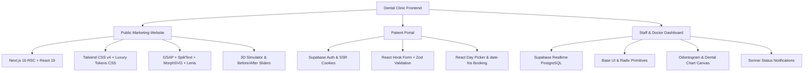

# Dental Clinic Management System — Frontend Tech Stack Documentation

> **Document Purpose**: Comprehensive technical overview of all frontend technologies, frameworks, styling tools, animation engines, and architectural libraries used across the application.  
> **Workspace**: `dental-clinic-workspace`  
> **Branch**: `feature/homepage-luxury-redesign-and-motion`  

---

## 1. Core Framework & Runtime Architecture

| Technology | Version | Purpose & Usage in Codebase |
| :--- | :--- | :--- |
| **Next.js (App Router)** | `16.2.6` | Primary full-stack framework. Powers all route segments (`src/app/(marketing)`, `src/app/(portal)`, `src/app/(staff)`, `src/app/api`), Server Components (RSC) for zero-JS SEO rendering, and Server Actions for data mutations. |
| **React** | `19.2.6` | Core UI library. Utilizes React 19 features, Server Components, client hooks (`useCallback`, `useEffect`, `useRef`), and concurrent rendering. |
| **TypeScript** | `5.9.3` | End-to-end type safety across all components, API route handlers, Supabase database schemas, and animation props. (`tsc --noEmit` validation). |
| **Vite / Vinext** | `8.0.13` / `0.0.50` | Lightning-fast local development runtime and HMR bundler optimized for Next.js App Router & Cloudflare Workers edge deployment. |

---

## 2. Styling & Design System Architecture

| Technology | Location / Files | How & Where It Is Used |
| :--- | :--- | :--- |
| **Tailwind CSS v4** | `src/styles/globals.css`, `tailwind.config.ts`, `@tailwindcss/postcss 4.2.1` | Modern utility CSS layer for responsive grids, flexbox layouts, spacing, flex gaps, and utility tokens. |
| **Luxury Design System Token Layer** | `src/styles/marketing-luxury.css` | Custom high-end dental design tokens: Deep Charcoal (`#0f1719`), Warm Ivory (`#faf9f5`), Sage Green (`#162a23`), bespoke typography pairings, and card elevation tokens. |
| **Macro-Scale & Layout Engine** | `src/styles/marketing-homepage-refinement.css` | Full-width `94–97vw` fluid desktop canvas scaling, standard `1800px` container widths, `40/60` editorial split compositions, and `2x2` responsive treatment grids. |
| **Class Utilities (`clsx`, `tailwind-merge`, `cva`)** | Throughout `src/components/` | Conditional class name resolution and dynamic UI variant composition without style conflicts. |

---

## 3. Motion & Animation Engine

| Library / Tool | Version | Implementation Details | Where It Is Used |
| :--- | :--- | :--- | :--- |
| **GSAP (GreenSock)** | `3.15.0` | Core high-performance animation engine (60fps transform & opacity updates). | Homepage orchestrator (`src/components/marketing/homepage-motion.tsx`) |
| **GSAP ScrollTrigger** | `3.15.0` | Scroll-linked triggers, pinned storytelling card decks, and scroll scrub parallax. | All homepage sections, Why Choose stacked cards, and treatment image scrub. |
| **GSAP SplitText** | `3.15.0` | Masked word-by-word typography reveal animations (`yPercent: 110-120 -> 0`). | Section headlines & titles (`data-motion-split="true"`). |
| **GSAP DrawSVG & MorphSVG** | `3.15.0` | SVG stroke drawing and dynamic path shape morphing from clinical curve to smile path. | Treatment Journey section (`luxury-motion-mark.tsx`). |
| **GSAP quickTo** | `3.15.0` | Hardware-accelerated magnetic cursor micro-interactions on hover. | All primary CTA buttons (`.btn-call`, `.btn-blue`, `.treatment-view-all-cta`). |
| **Lenis** | `1.3.26` | Inertial smooth scrolling synchronized directly with the GSAP ticker. | Scope-isolated to public homepage (`luxury-homepage-root`). |
| **Framer Motion** | `13.0.0` | Declarative layout animations and component transitions. | Portal modals, interactive tabs, and doctor scheduling views. |

---

## 4. UI Components, Icons & Interactive Widgets

| Library | Version | Purpose & Location |
| :--- | :--- | :--- |
| **Lucide React** | `1.31.0` | Lightweight SVG icons (`CalendarDays`, `Sparkles`, `ShieldCheck`, `Scan`, `Layers`, `ArrowRight`, `Phone`, `Mail`, `MapPin`) used across header, hero, footer, and cards. |
| **Base UI / Radix Primitives** | `@base-ui/react 1.7.0` | Accessible, unstyled UI primitives for accessible modals, dialogs, dropdowns, and accordions. |
| **Sonner** | `2.0.8` | High-performance toast notification system for booking confirmation and appointment alerts. |
| **React Day Picker & date-fns** | `10.0.1` / `4.4.0` | Interactive calendar date selection and formatting in the booking flow (`src/components/marketing/availability-panel.tsx`). |
| **Interactive 3D Cards** | Custom (`luxury-card3d.tsx`) | Mouse-tracking 3D perspective tilt with reflection sheen for journey and treatment cards. |
| **Before/After Dual Slider** | Custom (`luxury-before-after.tsx`) | Hardware-accelerated draggable comparison slider using CSS `clip-path: inset()`. |
| **Smile Preferences Simulator** | Custom (`luxury-smile-simulator.tsx`) | Interactive multi-parameter smile customizer with instant visual HUD feedback. |

---

## 5. Form Handling & Data Validation

| Technology | Version | Where It Is Used |
| :--- | :--- | :--- |
| **React Hook Form** | `7.85.0` | High-performance uncontrolled form state management in patient booking, contact forms, and medical history questionnaires. |
| **Zod** | `4.4.3` | Schema validation for form submissions, API payloads, and URL search parameters. |
| **@hookform/resolvers** | `5.7.1` | Bridge connecting Zod validation schemas directly with React Hook Form inputs. |

---

## 6. Backend Integration & Data Layer (Frontend Clients)

| Technology | Version | Role in Frontend |
| :--- | :--- | :--- |
| **@supabase/ssr** | `0.12.4` | Cookie-based Supabase authentication and session management in Next.js Server Components, middleware, and route handlers. |
| **@supabase/supabase-js** | `2.112.2` | Browser client for Realtime appointments, doctor availability subscriptions, and patient profile queries. |
| **Drizzle ORM** | `0.45.2` | Type-safe PostgreSQL schema definitions and query building for server-side endpoints and Server Actions. |

---

## 7. Area-by-Area Frontend Tech Mapping

### Summary Breakdown:
1. **Public Marketing Site (`/`, `/about`, `/services`, `/results`, `/book`)**: Focuses on **visual excellence**, **high-speed RSC delivery**, **Tailwind v4 + Vanilla Luxury CSS**, and **cinematic GSAP + Lenis scroll animations**.
2. **Patient Booking & Portal (`/portal`, `/book`)**: Focuses on **Supabase SSR Auth**, **React Hook Form + Zod**, and **interactive calendar scheduling**.
3. **Staff & Clinical Management (`/dashboard`, `/scheduler`, `/patients`)**: Focuses on **real-time synchronization**, **accessible Base UI components**, **clinical odontograms**, and **instant notification alerts**.